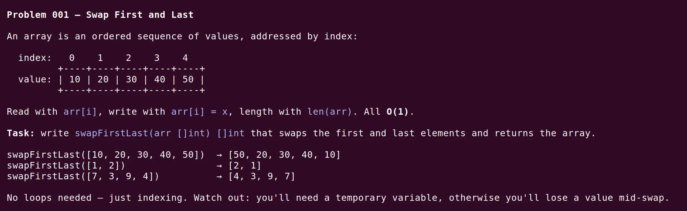

<h2 align="center">
    <picture>
        <source media="(prefers-color-scheme: dark)" srcset="logo-dark.svg">
        <source media="(prefers-color-scheme: light)" srcset="logo-light.svg">
        
    </picture>
    <br>
    AI-powered training for Go developers
</h2>

<div align="center">

[](docs/agents.md)
[](https://go.dev/)
[](https://github.com/open-spaced-repetition/go-fsrs)

</div>

**algotutor** turns an AI coding session into a personal tutor for Go.

It hosts multiple courses each with its own concept ladder, problem bank,
spaced-repetition review, mistake tracking, re-solves, and interleaved mix sessions.

Current courses:

- Algorithms & Data Structures
- Go Concurrency

You enroll in one or more courses, train in one course at a time, and switch whenever you
want. The agent keeps every course's state isolated: progress in algorithms doesn't move
your concurrency level, and vice versa.

<div align="center">



</div>

## Courses

| Slug    | Course                            | What you train                                                                      |
|---------|-----------------------------------|-------------------------------------------------------------------------------------|
| `algos` | Algorithms & Data Structures (Go) | 35 concepts — arrays, hash maps, recursion, trees, graphs, DP, interview shapes     |
| `conc`  | Go Concurrency                    | 31 concepts — goroutines, channels, select, mutex, context, patterns; race-detected |

Each course's concepts live in `courses/<slug>/docs/concepts.md`, problems in
`courses/<slug>/problem-bank.md`, and language traps in `courses/<slug>/docs/go-gotchas.md`.

## Getting started

```bash
git clone <repo>
cd algotutor
make init
```

`make init` runs an interactive (charm/huh-powered) setup:

1. Checks your Go version (≥ 1.26).
2. Detects available AI agents on your `$PATH` (Claude Code, Codex, OpenCode, Gemini CLI)
   and lets you pick a default — or skip and launch manually.
3. Prompts you to enroll in one or more courses.
4. Optionally launches your AI agent in this directory and types `train` for you.

Already initialized? Use:

- `make enroll` to add another course
- `make train` to start training in your default course
- `make train conc` to switch to and start training in a specific course
- `make review` / `make review conc` to start a spaced-repetition review session

## How it works

An AI agent acts as a tutor that generates progressively harder problems in Go for the
active course. It tracks your skill level on each concept and picks the next problem
based on where you are.

The agent reads its instructions from `AGENTS.md` (mirrored to `CLAUDE.md` and `GEMINI.md`).
On every flow it first reads `state.json` to know which course is active, then resolves
all course-specific paths to `courses/<active>/...`. Switching courses is instant —
type `train conc` and your concurrency progress takes over.

Working files for the active course live at the repo root:

| Active course | Working files              | Validation                        |
|---------------|----------------------------|-----------------------------------|
| `algos`       | `main.go`                  | `go run .` + `fmt.Println` checks |
| `conc`        | `main.go` + `main_test.go` | `go test -race ./...`             |

Read more details:
[algotutor: using AI to actually get better at algorithms](https://medium.com/@andreiboar/algotutor-using-ai-to-actually-get-better-at-algorithms-a2b7b96e054a)

### Commands

Type these to your agent (in addition to the `make` shortcuts above):

| Command                          | What it does                                                                  |
|----------------------------------|-------------------------------------------------------------------------------|
| `train`                          | Get the next problem in the active course                                     |
| `train <course>`                 | Switch to `<course>` and start training there                                 |
| `check`                          | Submit your solution for evaluation (grading, mistake logging, level updates) |
| `I don't know`                   | Break the problem into simpler sub-problems                                   |
| `I want to solve [problem name]` | Request a specific problem from the active course                             |
| `review`                         | Check if you have cards due for review                                        |
| `mistakes`                       | Show your recurring-error report for the active course                        |
| `enroll`                         | Add another course to your enrollment                                         |
| `reset`                          | Wipe progress in the active course (with `confirm reset` gate)                |
| `reset all`                      | Wipe progress in every enrolled course (with `confirm reset all` gate)        |

### Spaced repetition review

As you solve problems in either course, the agent automatically creates review cards
following the [SuperMemo 20 Rules](https://www.supermemo.com/en/blog/twenty-rules-of-formulating-knowledge).
Cards live in `courses/<slug>/cards.json` — separate per course.

Run `make review` (or `make review conc`) to start an Anki-style review session. The
review TUI uses [FSRS](https://github.com/open-spaced-repetition/go-fsrs) to schedule
cards. Rate each 1–4 (Again/Hard/Good/Easy) and it reappears at the optimal interval.


### Mistake tracking

Every failed `check` is tagged with a course-specific error taxonomy and logged to
`courses/<slug>/mistakes.json`.

- For algos: off-by-one, forgotten-update, missed base case, wrong-algorithm, etc.
- For concurrency: data-race, send-without-receiver, lock-order-inversion, goroutine-leaked,
  context-not-checked, and others.

When any category accumulates ≥ 3 unresolved entries in your recent history, `train`
hands you a tiny single-category drill — five-line problems stripped of surrounding
concept, aimed at exactly that failure mode. Solve it and the oldest open mistakes in
that category close out.

Every 7 days, `train` prints a digest of your top recurring categories. Run `mistakes`
any time to see the full report on demand. Drills don't raise concept levels — their only
effect is to patch the pattern.

### Re-solve

Solving a problem once isn't mastery. Every successfully solved problem enters a Leitner
schedule (7 / 21 / 60 / 180 / 365 days) in `courses/<slug>/resolve.json`. When a problem
comes due, `train` hands it back with a fresh template — your previous solution hidden —
and you re-solve it from scratch.

A clean re-solve pushes the next due date further out. Needing scaffolding holds the step.
Two consecutive failed re-solves on the same concept drop its level by one. Re-solves
preempt new training the moment anything is due.

### Mix

Once you have 5+ concepts at level 2+ in a course and at least 3 have gone cold (untouched
for 14+ days), `train` starts a mix session — 3 problems from 3 different concepts in
that course, one after the other. Mix is per-course; mixing across courses is not
supported (the contexts are too different).

Mix doesn't raise concept levels. It updates a per-concept retention score in
`courses/<slug>/retention.json`. Low retention shows up as a nudge on `train`.

## Requirements

- An AI coding agent — see [Supported agents](#supported-agents)
- [Go](https://go.dev/) ≥ 1.26

## Supported agents

algotutor works with any AI coding agent that can read files, edit files, and run shell
commands. Most agents auto-load `AGENTS.md` (or `CLAUDE.md` / `GEMINI.md`, byte-identical
mirrors).

| Agent                                                         | How to use                                                       |
|---------------------------------------------------------------|------------------------------------------------------------------|
| [Claude Code](https://docs.anthropic.com/en/docs/claude-code) | `claude` — auto-loads `CLAUDE.md`                                |
| [OpenAI Codex CLI](https://github.com/openai/codex)           | `codex --auto-edit` — auto-loads `AGENTS.md`                     |
| [Cursor](https://cursor.com)                                  | Open folder, switch to Agent mode — auto-loads `AGENTS.md`       |
| [Cline](https://github.com/cline/cline)                       | VS Code extension; type `train` in chat — auto-loads `AGENTS.md` |
| [OpenCode](https://github.com/sst/opencode)                   | `opencode` — auto-loads `AGENTS.md`                              |
| [Aider](https://aider.chat)                                   | `aider --read AGENTS.md`                                         |
| Gemini CLI                                                    | `gemini` — auto-loads `GEMINI.md`                                |

If you set a default agent during `make init`, `make train` and `make review` will
auto-launch it for you with the right prompt. Otherwise they print "Open your agent and
type `train`" and you do the launching.

You can switch agents mid-session — all state lives in JSON / Markdown files on disk, so
the next agent picks up exactly where the previous one left off.

See [docs/agents.md](docs/agents.md) for per-agent model selection, permission flags, and
bootstrap notes for agents that don't auto-load.

## Recommendations

The active course's working file(s) are always at the repo root: `main.go` for `algos`,
`main.go` + `main_test.go` for `conc`.

Before saying `check` to your agent, run **`make run`** for a local sanity check. It
dispatches based on the active course:

- `algos` → `go run .` (you eyeball the printed output against the expected-output comments)
- `conc` → `go test -race .` (race-detected test assertions on the root package)

Two distinct things happen at validation time:

- **`make run`** — local smoke test. "Did my code compile and produce reasonable output?"
- **`check`** (in agent) — full evaluation. "Is this *the right* solution? Update my
  level, log my mistakes, schedule a re-solve, create review cards."

Always run `make run` first. It's faster than a round-trip to your agent and surfaces
syntax errors and obvious bugs before the agent grades you.

Try to make as much progress as you can before saying `I don't know`. This way the agent
can better assess your gaps.

If you use an IDE with AI auto-completion, disable it.

It should feel effortful. Don't be afraid to say `I don't know` multiple times. Practice
regularly in sessions of 30–60 minutes.

For agent-specific tips (model selection, permission flags, defaults), see
[docs/agents.md](docs/agents.md).
