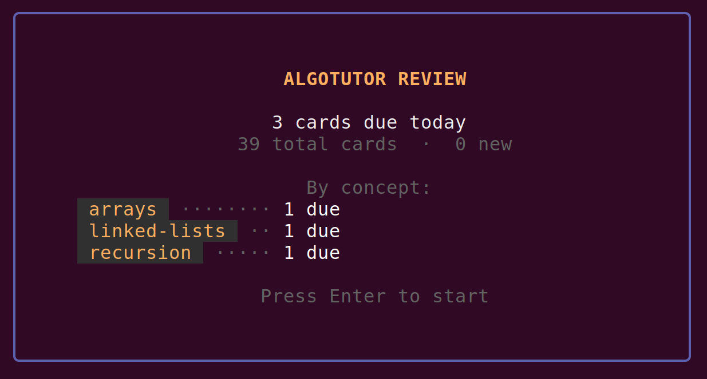
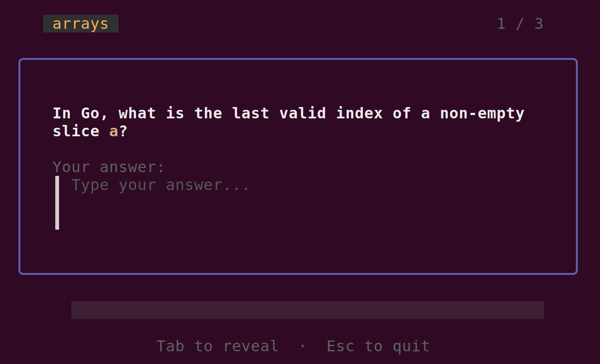

# algotutor

An AI-powered algorithmic training system. Open a Claude Code session in this directory, type `train`, and start solving
problems.

## How it works

Claude acts as a tutor that generates progressively harder algorithm problems in Go. It tracks your skill level across
32 concepts — from arrays and strings up through dynamic programming and system design — and picks the next problem
based on where you are.

### Commands

| Command                          | What it does                                |
|----------------------------------|---------------------------------------------|
| `train`                          | Get the next problem based on your progress |
| `check`                          | Submit your solution for evaluation         |
| `I don't know`                   | Break the problem into simpler sub-problems |
| `I want to solve [problem name]` | Request a specific problem                  |
| `review`                         | Check if you have cards due for review      |
| `mistakes`                       | Show your recurring-error report            |

### Concepts covered

**Fundamentals** — arrays, strings, loops, nested loops, math

**Core Data Structures** — maps, sets, matrix, stacks, queues, linked lists, heaps

**Core Techniques** — sorting, binary search, two pointers, sliding window, prefix sums, bit manipulation

**Recursion and Trees** — recursion, trees, tries

**Graph Algorithms** — graphs, topological sort, union-find, shortest path

**Advanced Techniques** — greedy, intervals, backtracking, divide and conquer, dynamic programming, monotonic stacks,
design

### Spaced repetition review

As you solve problems, Claude automatically creates review cards capturing what you learned — algorithmic patterns, Go
syntax, data structure properties. Cards follow
the [SuperMemo 20 Rules for effective memorization](https://www.supermemo.com/en/blog/twenty-rules-of-formulating-knowledge).

Run `make review` (or `go run ./cmd/review`) to start an Anki-style review session. The review TUI uses
the [FSRS](https://github.com/open-spaced-repetition/go-fsrs) algorithm to schedule cards. Rate each card 1–4 (
Again/Hard/Good/Easy) and it will reappear at the optimal interval.

### Mistake tracking

Every failed `check` is tagged with a fixed error taxonomy (off-by-one, forgotten-update, missed base case, empty-input
missed, wrong-algorithm, and ~25 more) and logged to `mistakes.json`. Gaps that would otherwise evaporate at the end of
a session stick around as data.

When any category accumulates ≥ 3 unresolved entries in your recent history, `train` stops picking a new concept and
instead hands you a tiny single-category drill — five-line problems stripped of surrounding concept, aimed at exactly
that failure mode. Solve it and the oldest open mistakes in that category close out.

Every 7 days, `train` prints a short digest of your top recurring categories. Run `mistakes` any time to see the full
report on demand. Drills do not raise concept levels — their only effect is to patch the pattern.

## Requirements

- [Claude Code](https://docs.anthropic.com/en/docs/claude-code)
- [Go](https://go.dev/)

## Getting started

1. Clone the repo
2. Open a Claude Code session in the directory
3. Type `train`

On first run, Claude will initialize your progress file and problem directory. Your progress is local and gitignored.

## Recommendations

You can use `claude --dangerously-skip-permissions` to not be prompted all the time.

The working problem is always inside `main.go`. You can validate with `go run .` before asking `claude check`.

Try to make as much progress as you can before saying `I don't know`. This way Claude can better assess your gaps and
missing prerequisites.

It should feel effortful.
